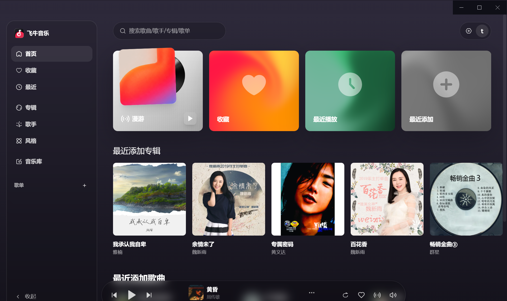

# fnmusic-exe · 飞牛音乐客户端

> 基于 Electron 封装的飞牛音乐客户端，核心解决网页版无法后台播放、最小化后切歌中断的痛点。



## 立项初衷

飞牛音乐官方早期仅提供网页版，存在两个让人难以忍受的问题：

1. **浏览器标签页切到后台后，音频会被节流甚至暂停**，导致切歌、自动播放下一首失效；
2. **关闭浏览器或清理 cookie 后登录态丢失**，需要反复扫码登录。

本项目就是为了给自己做一个能稳定后台播放、自动切歌的桌面客户端。本质上是用 Electron 套了一层壳，关掉后台节流、持久化登录态、加个托盘，让网页版"无感知"地当一个原生应用来用。

> **声明**：本项目为个人自用性质，仅供学习交流。一旦飞牛官方发布正式桌面客户端，本项目将停止维护并关闭仓库，请优先使用官方版本。

## 功能特性

- **后台不节流**：关闭 `backgroundThrottling`，窗口最小化 / 失焦后，页面定时器与音频仍正常推进，自动切歌不中断
- **登录态持久化**：基于 `persist:feiniu` 分区，cookies / localStorage 落盘到 `userData`，重启后免重新登录；会话型 cookie 自动续期 1 年
- **托盘常驻**：点叉叉 = 最小化到托盘，仅在托盘右键「退出」时真正关闭
- **无边框外观**：隐藏原生标题栏，保留右上角最小化 / 最大化 / 关闭覆盖层，顶部注入可拖拽区域
- **服务器地址可配置**：首次启动进入设置页输入服务器地址；菜单栏「设置 → 切换服务器地址」可随时切换
- **站内导航限制**：仅允许停留在已配置的服务器站内，外链自动转交系统默认浏览器打开
- **UA 伪装**：伪装为普通 Chrome 浏览器，避免被站点拦截
- **NSIS 安装包**：支持桌面快捷方式、开始菜单、自定义安装路径

## 安装与使用

### 方式一：直接安装（推荐）

下载 [Releases](../../releases) 中的 `飞牛音乐-Setup-x.x.x.exe`，双击安装即可。

首次启动会进入服务器地址输入页，填入你部署的飞牛音乐服务地址后进入主界面。

### 方式二：从源码运行

```bash
# 安装依赖
npm install

# 开发模式启动
npm start

# 打包 Windows 安装包
npm run dist

# 打包 portable 免安装版
npm run dist:portable
```

> 运行前需自行配置好 Node.js 环境与 Electron 依赖。

## 常见操作

| 操作 | 行为 |
| --- | --- |
| 点击窗口右上角 × | 最小化到托盘，不退出 |
| 单击托盘图标 | 显示 / 聚焦主窗口 |
| 托盘右键 → 显示主窗口 | 显示主窗口 |
| 托盘右键 → 退出飞牛音乐 | 真正退出应用 |
| 菜单栏 → 设置 → 切换服务器地址 | 回到设置页重新填写地址 |
| 菜单栏 → 设置 → 清除已保存地址并重置 | 删除配置文件并重置 |

## 配置文件位置

配置文件 `config.json` 与 cookie 存储位于 Electron 的 `userData` 目录：

- Windows: `%APPDATA%\feiniu-music\`

## 技术栈

- Electron 28
- electron-builder 24（NSIS 打包）
- 原生 JavaScript，无前端框架

## 版本号

当前版本：**v1.3.0**

本项目遵循 [语义化版本](https://semver.org/lang/zh-CN/)（Semantic Versioning）：

- **主版本号（MAJOR）**：存在不兼容的 API / 行为变更时递增
- **次版本号（MINOR）**：新增向下兼容的功能时递增
- **修订号（PATCH）**：仅做向下兼容的缺陷修复时递增

版本号同步维护在 [package.json](package.json) 的 `version` 字段。

## 更新日志

### v1.3.0

- 关闭 `backgroundThrottling`，解决窗口最小化 / 失焦后切歌中断的问题
- 会话型 cookie 自动续期 1 年，避免重启后需要重新登录
- 退出前 `flushStore` 强制落盘，兜底 1.5s 超时强制退出
- 叉叉改为最小化到托盘，仅托盘右键「退出」真正关闭
- 首次启动进入服务器地址设置页，配置后写入 `userData/config.json`
- 菜单栏新增「切换服务器地址」「清除已保存地址并重置」
- 站内导航限制：仅允许停留在已配置服务器站内，外链转交系统浏览器
- 伪装为普通 Chrome 浏览器 User-Agent
- 无边框窗口 + 顶部可拖拽条 + 右上角原生按钮覆盖层
- NSIS 安装包：自定义安装路径、桌面快捷方式、开始菜单快捷方式

### v1.2.0

- 基于 `persist:feiniu` 分区持久化 cookies / localStorage
- 新增托盘图标与右键菜单
- 服务器地址配置文件化，支持菜单栏切换

### v1.1.0

- 基础无边框窗口外观
- 注入顶部可拖拽区域，避免被覆盖层按钮遮挡

### v1.0.0

- 项目立项
- 基于 Electron 封装飞牛音乐网页，实现基础桌面客户端

## License

[MIT](LICENSE)
