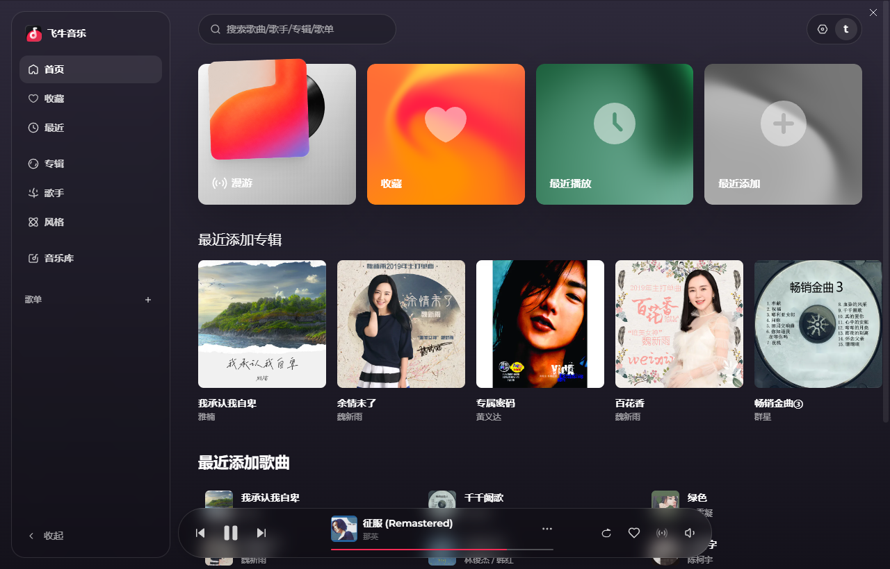

# fnmusic-exe · 飞牛音乐客户端

> 基于 Electron 封装的飞牛音乐客户端，核心解决网页版无法后台播放、最小化后切歌中断的痛点。

项目来源：https://github.com/wbc389561407/fnmusic-exe



## 立项初衷

飞牛音乐官方早期仅提供网页版，存在两个让人难以忍受的问题：

1. **浏览器标签页切到后台后，音频会被节流甚至暂停**，导致切歌、自动播放下一首失效；
2. **关闭浏览器或清理 cookie 后登录态丢失**，需要反复扫码登录。

本项目就是为了给自己做一个能稳定后台播放、自动切歌的桌面客户端。本质上是用 Electron 套了一层壳，关掉后台节流、持久化登录态、加个托盘，让网页版"无感知"地当一个原生应用来用。

> **声明**：本项目为个人自用性质，仅供学习交流。一旦飞牛官方发布正式桌面客户端，本项目将停止维护并关闭仓库，请优先使用官方版本。

## 功能特性

- **后台不节流**：关闭 `backgroundThrottling`，窗口最小化 / 失焦后，页面定时器与音频仍正常推进，自动切歌不中断
- **登录态持久化**：基于 `persist:feiniu` 分区，cookies / localStorage 落盘到 `userData`，重启后免重新登录；会话型 cookie 自动续期 1 年
- **托盘常驻**：点叉叉 = 最小化到托盘，仅在托盘右键「退出」时真正关闭
- **无边框外观**：隐藏原生标题栏，保留右上角最小化 / 最大化 / 关闭覆盖层，顶部注入可拖拽区域
- **服务器地址可配置**：首次启动进入设置页输入服务器地址；菜单栏「设置 → 切换服务器地址」可随时切换
- **站内导航限制**：仅允许停留在已配置的服务器站内，外链自动转交系统默认浏览器打开
- **UA 伪装**：伪装为普通 Chrome 浏览器，避免被站点拦截
- **NSIS 安装包**：支持桌面快捷方式、开始菜单、自定义安装路径

## 安装与使用

### 方式一：直接安装（推荐）

下载 [Releases](../../releases) 中的 `飞牛音乐-Setup-x.x.x.exe`，双击安装即可。

首次启动会进入服务器地址输入页，填入你部署的飞牛音乐服务地址后进入主界面。

### 方式二：从源码运行

```bash
# 安装依赖
npm install

# 开发模式启动
npm start

# 打包 Windows 安装包
npm run dist

# 打包 portable 免安装版
npm run dist:portable
```

> 运行前需自行配置好 Node.js 环境与 Electron 依赖。

## 常见操作

| 操作 | 行为 |
| --- | --- |
| 点击窗口右上角 × | 最小化到托盘，不退出 |
| 单击托盘图标 | 显示 / 聚焦主窗口 |
| 托盘右键 → 显示主窗口 | 显示主窗口 |
| 托盘右键 → 退出飞牛音乐 | 真正退出应用 |
| 菜单栏 → 设置 → 切换服务器地址 | 回到设置页重新填写地址 |
| 菜单栏 → 设置 → 清除已保存地址并重置 | 删除配置文件并重置 |

## 配置文件位置

配置文件 `config.json` 与 cookie 存储位于 Electron 的 `userData` 目录：

- Windows: `%APPDATA%\feiniu-music\`

## 技术栈

- Electron 28
- electron-builder 24（NSIS 打包）
- 原生 JavaScript，无前端框架

## 版本号

当前版本：**v2.0.0**

本项目遵循 [语义化版本](https://semver.org/lang/zh-CN/)（Semantic Versioning）：

- **主版本号（MAJOR）**：存在不兼容的 API / 行为变更时递增
- **次版本号（MINOR）**：新增向下兼容的功能时递增
- **修订号（PATCH）**：仅做向下兼容的缺陷修复时递增

版本号同步维护在 [package.json](package.json) 的 `version` 字段。

## 更新日志

### v2.0.0

- **重大修复**：解决 1.6.0 引入的 `setCertificateVerifyProc` 导致普通 https 站点（如 `your-domain.com`）SSL 握手被拒绝（`net_error -2 ERR_FAILED`）的严重问题
  - 根因：session 级 `setCertificateVerifyProc` 对非 fnos.net / 非 IP 域名返回 `callback(-2)`，该值在 Electron 中代表"直接拒绝"而非"使用默认验证"，导致所有普通 https 站点无法加载
  - 修复：移除 session 级 `setCertificateVerifyProc`，改用窗口级 `certificate-error` 事件，仅对 `*.fnos.net` 中转域名与 NAS 直连 IP 放行证书，普通 https 站点恢复 Chromium 默认验证
- 地址解析方法 `resolveAccessUrl(input)` 稳定化：fnid / IP / 域名 / 完整地址统一入口，输出可直接浏览器打开的访问地址
- 持久化改为记录用户原始输入（`serverInput`），每次启动重新走 `resolveAccessUrl` 确认本次访问地址，fnid 不再缓存解析结果
- `ensureMusicSuffix` 统一补 `/music/`（带尾斜杠），避免服务器 301 重定向触发 `ERR_FAILED`
- fnid 简化为直接构造中继地址 `https://{fnid}.fnos.net/music/`，移除 fnos.net API 解析与并发探测逻辑
- 导航放行：`isNavigationAllowed` 放行 fnos.net 域内互转（子域名 ↔ 路径形式），避免中继 301 被拦截后丢到外部浏览器
- 移除冗余的 `crypto` / `net` 依赖与 FNOS API 签名常量
- 全链路加诊断日志（`[resolveAccessUrl]` / `[will-navigate]` / `[did-fail-load]` 等），便于排查加载问题

### v1.8.1

- 修复访问 `https://your-domain.com/music` 卡在"连接中"的问题：服务器 301 重定向 `/music` → `/music/`，Electron `loadURL` 跟随重定向时出现 `ERR_FAILED`
- `ensureMusicSuffix` 统一补成 `/music/`（带尾斜杠），fnid 中继地址同步改为 `/music/`，从源头避免 301 重定向

### v1.8.0

- 重构地址解析：新增统一方法 `resolveAccessUrl(input)`，fnid / IP / 完整地址统一入口
- 持久化改为记录用户原始输入（`serverInput`），不再分 fnid / serverUrl 两个字段
- 每次启动读取原始输入，重新走 `resolveAccessUrl` 确认本次访问地址
- 移除 buildFnidUrl / loadFnid，fnid 分支并入统一解析方法

### v1.7.0

- 简化 fnid 访问逻辑：fnid 直接走中继地址 `https://{fnid}.fnos.net/music`，不再调用 fnos.net API 解析候选、不再探测公网/局域网地址
- 移除 resolveFnid / probeCandidates 及相关签名常量，去掉 crypto / net 依赖
- fnid 持久化 fnid 本身（非解析地址），下次启动直接用 fnid 构造中继地址加载

### v1.6.0

- 新增 fnid 登录支持：输入 fnid（如 `your-fnid`）自动通过 `fnos.net` API 解析真实服务器地址
- 局域网 / 外网智能适配：fnid 解析返回多个候选地址（局域网 IP、公网 IP、relay 中转），并发探测选最优可达地址
  - 局域网内优先用局域网 IP 直连（http，最快）
  - 外网用公网 IP 直连（http）
  - 都不通时用 fnos.net 中转（https 兜底）
- 放行 `*.fnos.net` 中转域名与 NAS 直连 IP 的 SSL 证书验证，解决证书过期 / 自签证书导致无法加载的问题（`ERR_CERT_DATE_INVALID`）
- fnid 解析与探测均加超时兜底，避免网络挂起导致界面卡在"连接中"

### v1.5.4

- 服务器地址输入页面新增项目来源链接（`https://github.com/wbc389561407/fnmusic-exe`）
- 调整地址输入逻辑：纯 IP 自动补 `http://` 与 `:5666` 默认端口；带协议 / 带端口则完全尊重用户输入
- 应用单实例锁：重复双击桌面图标不再启动多个程序，改为聚焦到已有窗口

### v1.5.3

- 服务器地址输入不以 `/music` 或 `/music/` 结尾时，自动补全 `/music` 后缀，不再弹错误提示拦截

### v1.5.2

- 不带协议的地址默认按 `http` 访问，解决 http 流量被强制升级到 https 导致不通的问题

### v1.5.1

- 窗口启动背景与右上角叉叉按钮覆盖层底色改为透明，启动后顶部不再有黑色遮挡
- 修复顶部拖拽条 padding 注入导致页面内部 `100vh` 布局被裁切、底部播放控制栏（上一首 / 下一首）溢出窗口边界的问题，改为纯浮动拖拽条不占布局空间

### v1.5.0

- 服务器地址校验：输入地址必须以 `/music` 或 `/music/` 结尾，否则不跳转并提示用户

### v1.4.0

- 隐藏窗口右上角最小化 / 最大化按钮，仅保留叉叉（最小化到托盘）
- 托盘右键菜单新增「重置地址」：一键清空服务器地址配置与所有持久化存储（cookies / localStorage），回到设置页重新填写

### v1.3.0

- 关闭 `backgroundThrottling`，解决窗口最小化 / 失焦后切歌中断的问题
- 会话型 cookie 自动续期 1 年，避免重启后需要重新登录
- 退出前 `flushStore` 强制落盘，兜底 1.5s 超时强制退出
- 叉叉改为最小化到托盘，仅托盘右键「退出」真正关闭
- 首次启动进入服务器地址设置页，配置后写入 `userData/config.json`
- 菜单栏新增「切换服务器地址」「清除已保存地址并重置」
- 站内导航限制：仅允许停留在已配置服务器站内，外链转交系统浏览器
- 伪装为普通 Chrome 浏览器 User-Agent
- 无边框窗口 + 顶部可拖拽条 + 右上角原生按钮覆盖层
- NSIS 安装包：自定义安装路径、桌面快捷方式、开始菜单快捷方式

### v1.2.0

- 基于 `persist:feiniu` 分区持久化 cookies / localStorage
- 新增托盘图标与右键菜单
- 服务器地址配置文件化，支持菜单栏切换

### v1.1.0

- 基础无边框窗口外观
- 注入顶部可拖拽区域，避免被覆盖层按钮遮挡

### v1.0.0

- 项目立项
- 基于 Electron 封装飞牛音乐网页，实现基础桌面客户端

## License

[MIT](LICENSE)
